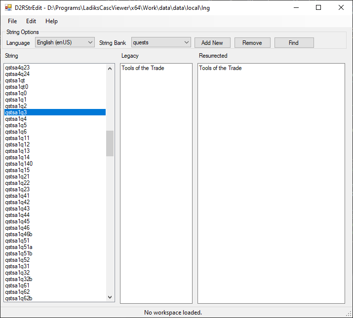

= D2RStrEdit =

Diablo II: Resurrected changed the system for translation from being handled in a proprietary .TBL file format to being a collection of JSON files. This tool allows you to manipulate those JSON files easily and efficiently.

Please note that Diablo II: Resurrected has not currently released and this tool is based on the tech alpha version of the game. The final retail release might be different.

== Using the tool ==

First, extract the entire `data/local/lng` folder from the game's CASC files using a tool such as Ladik's CASC Viewer. Place the folder within `<game dir>/data/local/lng`.

Open D2RStrEdit and select `<game dir>/data/local/lng` as the workspace. Now you are ready to make edits.

You will need a modified version of the game, such as D2RModding, to be able to load the modified files.

== Screenshots ==

== Hotkeys ==

 * CTRL-O = Open
 * CTRL-S = Save
 * CTRL+R = Create new key
 * CTRL+Del = Delete the current key (use with caution)
 * CTRL-F = Find
 * CTRL+Up = Scroll to the previous string
 * CTRL+Down = Scroll to the next string
 * F2 = Rename string
 * CTRL+1 = Focus on the string list
 * CTRL+2 = Select all text in the Resurrected box and focus on it.
 * CTRL+3 = Select all text in the Legacy box and focus on it. 

== Version History ==

 * v1.0.3: Fixed Find feature not working properly.
 * v1.0.2: Fixed a major issue that rendered the tool useless.
 * v1.0.0: Initial revision.

== Future Goals ==

 * Export/Import from plaintext
 * Go To Index
 * Show index numbers on text, both hex/decimal
 * Copy Mode (typing in Legacy types also in Resurrected and vice versa)

== Known Bugs ==

 * Deleting a key won't shift indexes back. It isn't known what happens when this occurs, so just use caution.
 * The toolbar at the bottom is basically nonfunctional at this time.
 * Stretching the main window doesn't work properly.
 * There might be other bugs that exist. If you find any more, please report them on the GitHub issues page.

== Contributing ==

Feel free to submit pull requests.

== License ==

This tool is licensed under the GNU General Public License v3 (GPLv3). A copy of the license is included with the source code and release of the tool.

== Source Code ==

The source code is available at <source code location>